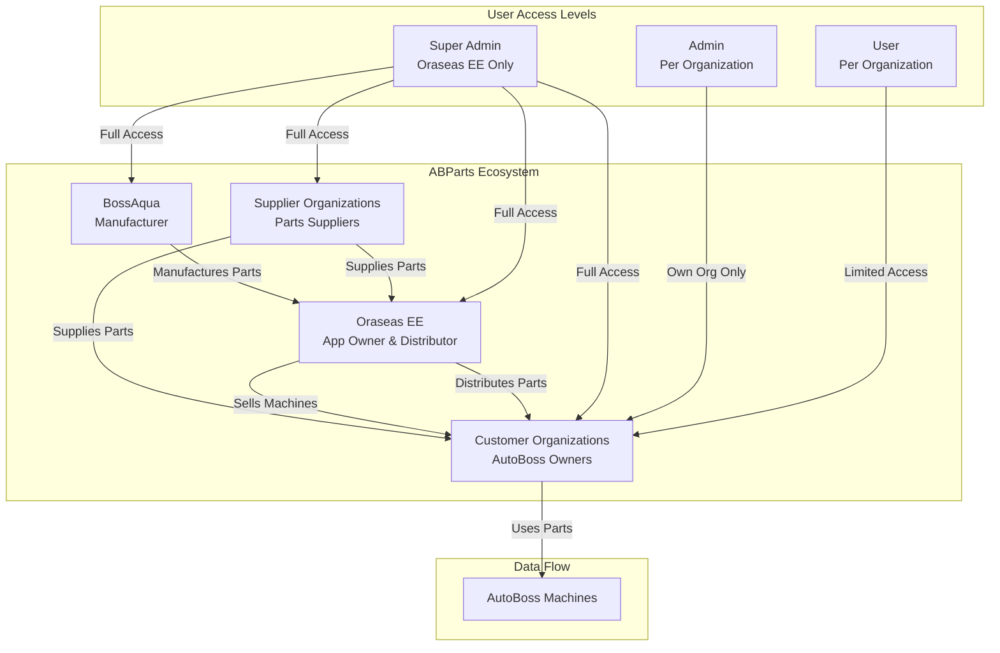
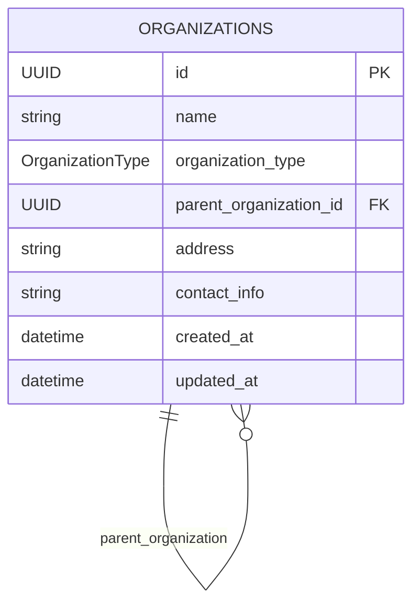
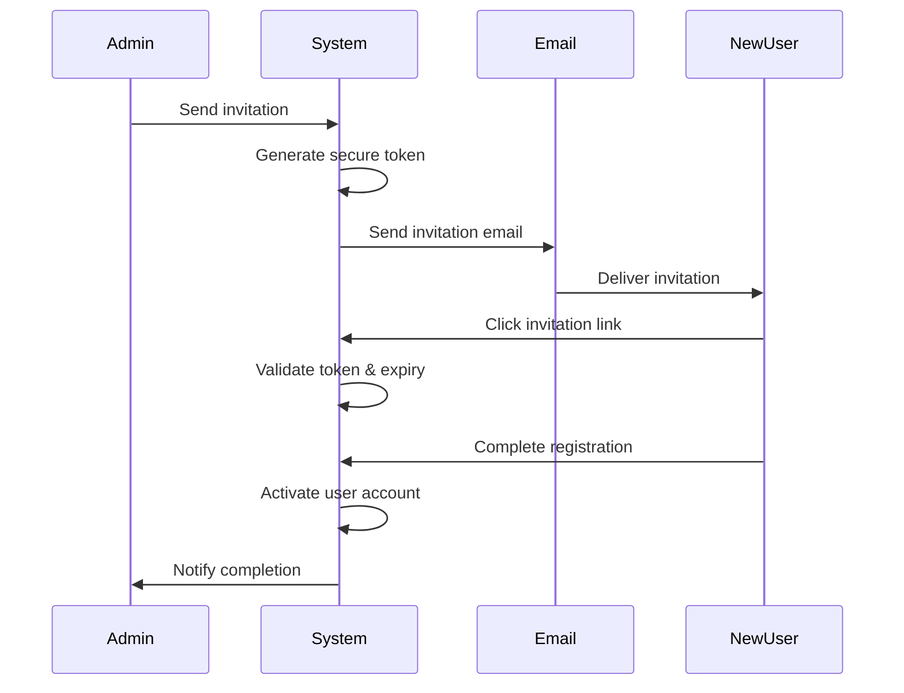
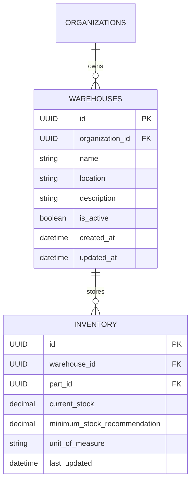
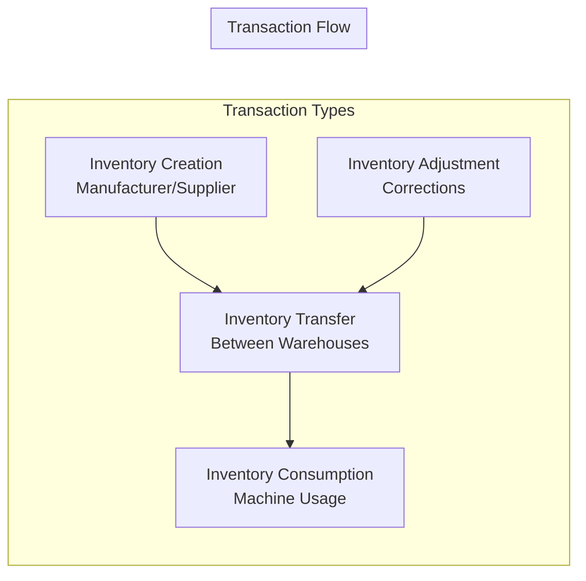
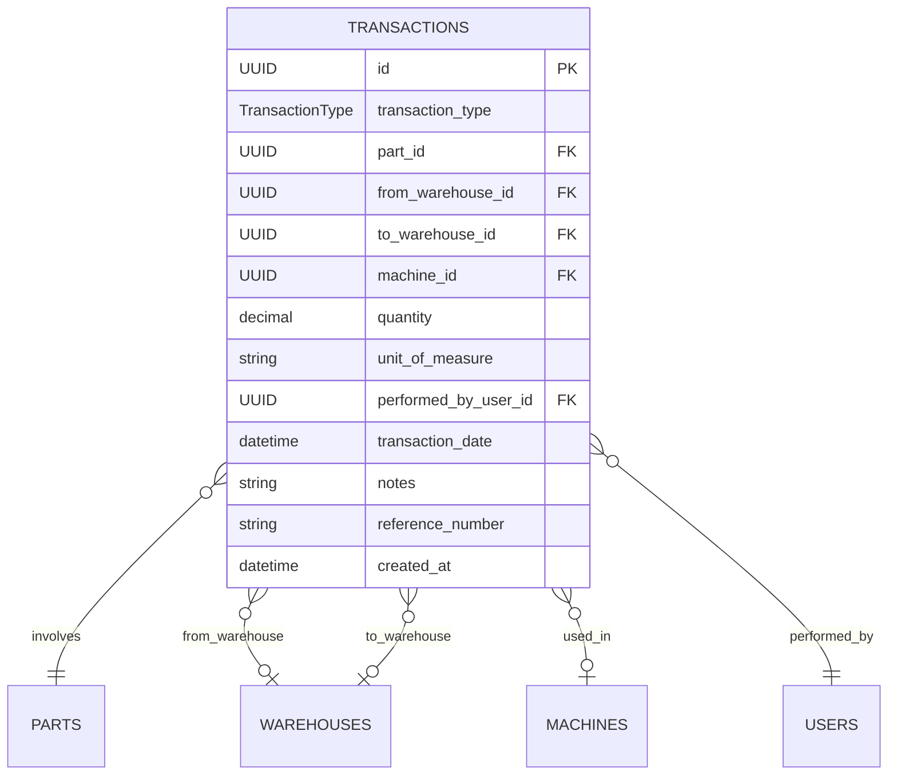

# Design Document: ABParts Business Model Alignment

## Overview

This design document outlines the architectural changes needed to align the ABParts application with the actual business model of Oraseas EE's AutoBoss parts distribution system. The design addresses critical misalignments in the current data model and implements proper business relationships, user access control, and transaction workflows.

## Scale and Performance Requirements

The system is designed to efficiently handle:
- **100 customer organizations** with hierarchical relationships
- **200 total users** with role-based access control
- **200 parts catalog** with complex classification and inventory tracking
- **150 AutoBoss machines** with usage history and maintenance tracking
- **150 warehouses** across all organizations with real-time inventory
- **7,500 transactions per year** (50 per machine) with full audit trail

**Performance Targets:**
- API response times < 200ms for standard operations
- Dashboard load times < 1 second
- Transaction processing < 500ms
- Inventory calculations real-time
- Support for 50 concurrent users
- 99.9% uptime availability

## Architecture

### Current vs. Target Architecture

**Current Issues:**
- Organizations are treated generically without business type differentiation
- User roles don't reflect actual business hierarchy
- Inventory is directly linked to organizations instead of warehouses
- Missing proper transaction tracking for parts flow
- Access control doesn't enforce business relationships

**Target Architecture:**
- Hierarchical organization structure with proper business types
- Role-based access control aligned with business permissions
- Warehouse-centric inventory management
- Comprehensive transaction tracking system
- Business rule enforcement at the data layer

### System Context Diagram



## Components and Interfaces

### 1. Enhanced Organization Management

#### Organization Types Enum
```typescript
enum OrganizationType {
  ORASEAS_EE = "oraseas_ee",
  BOSSAQUA = "bossaqua", 
  CUSTOMER = "customer",
  SUPPLIER = "supplier"
}
```

#### Organization Hierarchy


### 2. Comprehensive User Management System

#### User Roles and Permissions
```typescript
enum UserRole {
  USER = "user",           // Basic operations within own org
  ADMIN = "admin",         // Full management within own org  
  SUPER_ADMIN = "super_admin" // Full access across all orgs
}

interface UserPermissions {
  canViewAllOrganizations: boolean;
  canManageWarehouses: boolean;
  canAdjustInventory: boolean;
  canRegisterMachines: boolean;
  canManageSuppliers: boolean;
  canViewTransactions: boolean;
  canInviteUsers: boolean;
  canManageUsers: boolean;
  canViewAuditLogs: boolean;
  canManageOwnProfile: boolean;
}

enum UserStatus {
  ACTIVE = "active",
  INACTIVE = "inactive", 
  PENDING_INVITATION = "pending_invitation",
  LOCKED = "locked"
}
```

#### User Invitation System


#### Session Management
```typescript
interface SessionConfig {
  sessionDuration: 8 * 60 * 60 * 1000; // 8 hours in milliseconds
  refreshTokenDuration: 7 * 24 * 60 * 60 * 1000; // 7 days
  maxFailedAttempts: 5;
  lockoutDuration: 15 * 60 * 1000; // 15 minutes
  inactivityThreshold: 90 * 24 * 60 * 60 * 1000; // 90 days
}

interface SecurityEvent {
  userId: UUID;
  eventType: 'login' | 'logout' | 'failed_login' | 'password_change' | 'account_locked';
  ipAddress: string;
  userAgent: string;
  timestamp: Date;
  success: boolean;
  details?: Record<string, any>;
}
```

### 3. Warehouse Management System

#### Warehouse Entity Design


### 4. Enhanced Parts Classification

#### Parts Type System
```typescript
enum PartType {
  CONSUMABLE = "consumable",     // Whole units (filters, belts)
  BULK_MATERIAL = "bulk_material" // Measurable quantities (oil, chemicals)
}

interface PartSpecification {
  id: UUID;
  partNumber: string;
  name: string;
  description: string;
  partType: PartType;
  isProprietary: boolean; // true for BossAqua parts
  unitOfMeasure: string; // "pieces", "liters", "kg", etc.
  manufacturerPartNumber?: string;
  imageUrls: string[];
}
```

### 5. Transaction Tracking System

#### Transaction Types and Flow


#### Transaction Entity Design


## Data Models

### 1. Updated Organization Model

```python
class Organization(Base):
    __tablename__ = "organizations"
    
    id = Column(UUID(as_uuid=True), primary_key=True, default=uuid.uuid4)
    name = Column(String(255), unique=True, nullable=False, index=True)
    organization_type = Column(Enum(OrganizationType), nullable=False)
    parent_organization_id = Column(UUID(as_uuid=True), ForeignKey("organizations.id"), nullable=True)
    address = Column(Text)
    contact_info = Column(Text)
    is_active = Column(Boolean, default=True, nullable=False)
    created_at = Column(DateTime(timezone=True), server_default=func.now())
    updated_at = Column(DateTime(timezone=True), server_default=func.now(), onupdate=func.now())
    
    # Relationships
    parent_organization = relationship("Organization", remote_side=[id])
    child_organizations = relationship("Organization", back_populates="parent_organization")
    warehouses = relationship("Warehouse", back_populates="organization")
    users = relationship("User", back_populates="organization")
    machines = relationship("Machine", back_populates="customer_organization")
    
    # Business rule constraints
    __table_args__ = (
        CheckConstraint(
            "organization_type != 'supplier' OR parent_organization_id IS NOT NULL",
            name="supplier_must_have_parent"
        ),
    )
```

### 2. New Warehouse Model

```python
class Warehouse(Base):
    __tablename__ = "warehouses"
    
    id = Column(UUID(as_uuid=True), primary_key=True, default=uuid.uuid4)
    organization_id = Column(UUID(as_uuid=True), ForeignKey("organizations.id"), nullable=False)
    name = Column(String(255), nullable=False)
    location = Column(String(500))
    description = Column(Text)
    is_active = Column(Boolean, default=True, nullable=False)
    created_at = Column(DateTime(timezone=True), server_default=func.now())
    updated_at = Column(DateTime(timezone=True), server_default=func.now(), onupdate=func.now())
    
    # Relationships
    organization = relationship("Organization", back_populates="warehouses")
    inventory_items = relationship("Inventory", back_populates="warehouse")
    
    # Unique constraint
    __table_args__ = (
        UniqueConstraint('organization_id', 'name', name='_org_warehouse_name_uc'),
    )
```

### 3. Enhanced Parts Model

```python
class Part(Base):
    __tablename__ = "parts"
    
    id = Column(UUID(as_uuid=True), primary_key=True, default=uuid.uuid4)
    part_number = Column(String(255), unique=True, nullable=False, index=True)
    name = Column(String(255), nullable=False)
    description = Column(Text)
    part_type = Column(Enum(PartType), nullable=False, default=PartType.CONSUMABLE)
    is_proprietary = Column(Boolean, nullable=False, default=False)
    unit_of_measure = Column(String(50), nullable=False, default="pieces")
    manufacturer_part_number = Column(String(255))
    image_urls = Column(ARRAY(Text))
    created_at = Column(DateTime(timezone=True), server_default=func.now())
    updated_at = Column(DateTime(timezone=True), server_default=func.now(), onupdate=func.now())
```

### 4. Updated Inventory Model

```python
class Inventory(Base):
    __tablename__ = "inventory"
    
    id = Column(UUID(as_uuid=True), primary_key=True, default=uuid.uuid4)
    warehouse_id = Column(UUID(as_uuid=True), ForeignKey("warehouses.id"), nullable=False)
    part_id = Column(UUID(as_uuid=True), ForeignKey("parts.id"), nullable=False)
    current_stock = Column(DECIMAL(10, 3), nullable=False, default=0)  # Support decimals
    minimum_stock_recommendation = Column(DECIMAL(10, 3), nullable=False, default=0)
    unit_of_measure = Column(String(50), nullable=False)
    last_updated = Column(DateTime(timezone=True), server_default=func.now(), onupdate=func.now())
    created_at = Column(DateTime(timezone=True), server_default=func.now())
    
    # Relationships
    warehouse = relationship("Warehouse", back_populates="inventory_items")
    part = relationship("Part", back_populates="inventory_items")
    
    # Unique constraint
    __table_args__ = (
        UniqueConstraint('warehouse_id', 'part_id', name='_warehouse_part_uc'),
    )
```

### 5. New Transaction Model

```python
class Transaction(Base):
    __tablename__ = "transactions"
    
    id = Column(UUID(as_uuid=True), primary_key=True, default=uuid.uuid4)
    transaction_type = Column(Enum(TransactionType), nullable=False)
    part_id = Column(UUID(as_uuid=True), ForeignKey("parts.id"), nullable=False)
    from_warehouse_id = Column(UUID(as_uuid=True), ForeignKey("warehouses.id"), nullable=True)
    to_warehouse_id = Column(UUID(as_uuid=True), ForeignKey("warehouses.id"), nullable=True)
    machine_id = Column(UUID(as_uuid=True), ForeignKey("machines.id"), nullable=True)
    quantity = Column(DECIMAL(10, 3), nullable=False)
    unit_of_measure = Column(String(50), nullable=False)
    performed_by_user_id = Column(UUID(as_uuid=True), ForeignKey("users.id"), nullable=False)
    transaction_date = Column(DateTime(timezone=True), nullable=False)
    notes = Column(Text)
    reference_number = Column(String(100))
    created_at = Column(DateTime(timezone=True), server_default=func.now())
    
    # Relationships
    part = relationship("Part")
    from_warehouse = relationship("Warehouse", foreign_keys=[from_warehouse_id])
    to_warehouse = relationship("Warehouse", foreign_keys=[to_warehouse_id])
    machine = relationship("Machine")
    performed_by_user = relationship("User")
```

## Error Handling

### Business Rule Validation

1. **Organization Type Constraints**
   - Only one Oraseas EE organization allowed
   - Only one BossAqua organization allowed
   - Suppliers must have parent organization
   - Validate organization hierarchy depth

2. **User Role Validation**
   - Super admins must belong to Oraseas EE
   - Each organization must have at least one admin
   - Role-based feature access enforcement

3. **Inventory Transaction Validation**
   - Prevent negative inventory (configurable)
   - Validate unit of measure consistency
   - Ensure transaction balance (from/to warehouses)

4. **Access Control Validation**
   - Users can only access own organization data
   - Super admins have unrestricted access
   - Validate warehouse ownership before operations

### Error Response Structure

```typescript
interface BusinessRuleError {
  code: string;
  message: string;
  field?: string;
  context?: Record<string, any>;
}

// Examples
{
  code: "ORGANIZATION_TYPE_VIOLATION",
  message: "Only one Oraseas EE organization is allowed",
  field: "organization_type"
}

{
  code: "INSUFFICIENT_INVENTORY", 
  message: "Cannot consume 5.5L - only 3.2L available",
  field: "quantity",
  context: { available: 3.2, requested: 5.5, unit: "liters" }
}
```

## Testing Strategy

### Unit Tests
- Business rule validation functions
- Permission checking logic
- Inventory calculation methods
- Transaction processing functions

### Integration Tests
- Organization hierarchy operations
- User role and permission enforcement
- Warehouse and inventory management workflows
- Transaction recording and inventory updates

### Business Logic Tests
- End-to-end transaction flows
- Multi-organization access control scenarios
- Inventory balance calculations
- Machine registration and ownership tracking

### Data Migration Tests
- Current data model to new model migration
- Data integrity validation post-migration
- Performance impact assessment

## Migration Strategy

### Phase 1: Data Model Updates
1. Add new columns to existing tables
2. Create new tables (Warehouses, Transactions)
3. Migrate existing inventory to warehouse-based model
4. Update foreign key relationships

### Phase 2: Business Logic Implementation
1. Implement organization type validation
2. Add user role permission checking
3. Create transaction recording system
4. Update inventory calculation logic

### Phase 3: API Updates
1. Update existing endpoints for new data model
2. Add new endpoints for warehouse management
3. Implement transaction tracking APIs
4. Update authentication and authorization

### Phase 4: Frontend Updates
1. Update organization management UI
2. Add warehouse management interfaces
3. Implement transaction history views
4. Update user role management

## Performance and Scalability Considerations

### Database Optimization for Scale

Given the scale requirements (100 customers, 200 users, 200 parts, 150 machines, 150 warehouses, 7,500 transactions/year), the following optimizations are recommended:

#### Indexing Strategy
```sql
-- Critical indexes for performance
CREATE INDEX idx_organizations_type ON organizations(organization_type);
CREATE INDEX idx_organizations_parent ON organizations(parent_organization_id);
CREATE INDEX idx_warehouses_org ON warehouses(organization_id);
CREATE INDEX idx_inventory_warehouse_part ON inventory(warehouse_id, part_id);
CREATE INDEX idx_transactions_date ON transactions(transaction_date);
CREATE INDEX idx_transactions_part ON transactions(part_id);
CREATE INDEX idx_transactions_warehouse ON transactions(from_warehouse_id, to_warehouse_id);
CREATE INDEX idx_users_org_role ON users(organization_id, role);
CREATE INDEX idx_machines_customer ON machines(customer_organization_id);
```

#### Query Optimization
- Use database views for complex organization hierarchy queries
- Implement materialized views for inventory aggregations
- Cache frequently accessed data (parts catalog, organization hierarchy)
- Use connection pooling for database connections

### Caching Strategy

#### Redis Caching Implementation
```typescript
interface CacheStrategy {
  // Static data - cache for 1 hour
  partsCatalog: CacheConfig<3600>;
  organizationHierarchy: CacheConfig<3600>;
  
  // Semi-static data - cache for 15 minutes  
  warehouseList: CacheConfig<900>;
  userPermissions: CacheConfig<900>;
  
  // Dynamic data - cache for 5 minutes
  inventoryLevels: CacheConfig<300>;
  dashboardMetrics: CacheConfig<300>;
  
  // Real-time data - no caching
  activeTransactions: CacheConfig<0>;
}
```

### API Performance Optimization

#### Response Time Targets
- **Organization queries**: < 50ms (cached hierarchy)
- **Inventory lookups**: < 100ms (indexed warehouse+part)
- **Transaction recording**: < 200ms (with validation)
- **Dashboard metrics**: < 500ms (cached aggregations)
- **Search operations**: < 300ms (full-text indexes)

#### Pagination and Filtering
```typescript
interface PaginationConfig {
  defaultPageSize: 25;
  maxPageSize: 100;
  
  // For large datasets
  transactionHistory: { pageSize: 50, maxPages: 20 };
  inventoryReports: { pageSize: 100, maxPages: 10 };
}
```

### Concurrent User Support

#### Session Management
- JWT tokens with 8-hour expiration
- Refresh token rotation for security
- Session cleanup for inactive users
- Rate limiting: 100 requests/minute per user

#### Database Connection Management
```python
# Connection pool configuration
DATABASE_POOL_CONFIG = {
    "pool_size": 20,        # Base connections
    "max_overflow": 30,     # Additional connections under load
    "pool_timeout": 30,     # Wait time for connection
    "pool_recycle": 3600,   # Recycle connections hourly
}
```

### Monitoring and Alerting

#### Key Performance Indicators
- API response times (95th percentile < 200ms)
- Database query performance (slow query log)
- Cache hit rates (> 80% for static data)
- Concurrent user count (target: 50 users)
- Transaction processing rate (< 1 second end-to-end)

#### Health Checks
```typescript
interface HealthMetrics {
  database: {
    connectionPool: number;
    queryResponseTime: number;
    activeConnections: number;
  };
  cache: {
    hitRate: number;
    memoryUsage: number;
    connectionStatus: boolean;
  };
  application: {
    activeUsers: number;
    requestsPerMinute: number;
    errorRate: number;
  };
}
```

### Scalability Considerations

#### Horizontal Scaling Preparation
- Stateless API design (no server-side sessions)
- Database read replicas for reporting queries
- CDN for static assets (part images)
- Load balancer ready architecture

#### Data Archival Strategy
```typescript
interface ArchivalPolicy {
  transactions: {
    activeData: "2 years",
    archiveAfter: "2 years", 
    deleteAfter: "7 years"
  };
  auditLogs: {
    activeData: "1 year",
    archiveAfter: "1 year",
    deleteAfter: "5 years"  
  };
}
```

### Security Performance

#### Authentication Optimization
- JWT token validation caching
- Role-based access control caching
- Organization hierarchy permission caching
- Brute force protection with exponential backoff

This design provides a solid foundation for aligning ABParts with the actual business model while ensuring optimal performance at the specified scale.