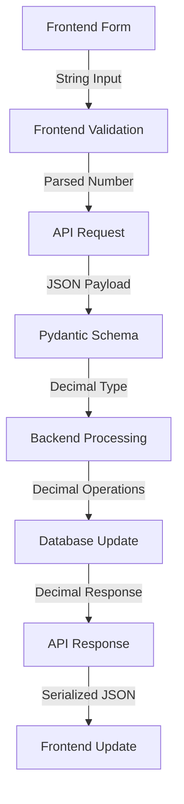

# Design Document: Inventory Transfer Fix

## Overview

The inventory transfer functionality in ABParts is experiencing critical failures due to data type inconsistencies between the frontend, API schemas, and backend processing. The core issue is that the system mixes `float` and `decimal.Decimal` types when handling inventory quantities, leading to arithmetic operation failures and API errors.

This design addresses the root cause by establishing consistent decimal handling throughout the entire inventory transfer pipeline, from frontend input validation to backend database operations.

## Architecture

### Current Architecture Issues

1. **Frontend**: Sends quantities as JavaScript numbers (float)
2. **API Schema**: `InventoryTransferRequest.quantity` defined as `float`
3. **Backend Processing**: Attempts to perform arithmetic with `decimal.Decimal` types from database
4. **Database**: Uses `DECIMAL(precision=10, scale=3)` for inventory quantities

### Target Architecture



## Components and Interfaces

### 1. Frontend Component Updates

**File**: `frontend/src/components/InventoryTransferForm.js`

**Changes Required**:
- Enhanced input validation for decimal quantities
- Improved error handling for API responses
- Better user feedback during transfer operations
- Consistent decimal formatting for display

**Key Functions**:
```javascript
// Enhanced quantity validation
const validateQuantity = (value, availableStock) => {
  const quantity = parseFloat(value);
  if (isNaN(quantity) || quantity <= 0) {
    return { valid: false, error: 'Quantity must be a positive number' };
  }
  if (quantity > availableStock) {
    return { valid: false, error: `Insufficient stock. Available: ${availableStock}` };
  }
  return { valid: true };
};

// Improved error handling
const handleTransferError = (error) => {
  if (error.response?.data?.detail) {
    return error.response.data.detail;
  }
  return 'Failed to transfer inventory. Please try again.';
};
```

### 2. API Schema Corrections

**File**: `backend/app/schemas/inventory.py`

**Current Issue**:
```python
class InventoryTransferRequest(BaseModel):
    quantity: float = Field(..., gt=0)  # ❌ Causes type mismatch
```

**Fixed Implementation**:
```python
from decimal import Decimal

class InventoryTransferRequest(BaseModel):
    from_warehouse_id: uuid.UUID
    to_warehouse_id: uuid.UUID
    part_id: uuid.UUID
    quantity: Decimal = Field(..., gt=0, description="Quantity to transfer (must be positive)")
    notes: Optional[str] = Field(None, max_length=500)
    
    class Config:
        json_encoders = {
            Decimal: lambda v: float(v)  # For JSON serialization
        }
```

### 3. Backend Processing Enhancements

**File**: `backend/app/crud/inventory.py`

**Current Issues**:
- Function signature uses `quantity: float`
- Arithmetic operations mix float and Decimal types
- Insufficient error handling for type conversion

**Enhanced Implementation**:
```python
from decimal import Decimal, InvalidOperation

def transfer_inventory_between_warehouses(
    db: Session, 
    from_warehouse_id: uuid.UUID,
    to_warehouse_id: uuid.UUID, 
    part_id: uuid.UUID, 
    quantity: Decimal,  # ✅ Changed from float
    performed_by_user_id: uuid.UUID
) -> dict:
    """Transfer inventory between warehouses with enhanced error handling."""
    
    try:
        # Ensure quantity is Decimal type
        if not isinstance(quantity, Decimal):
            quantity = Decimal(str(quantity))
            
        # Validate quantity precision (3 decimal places max)
        if quantity.as_tuple().exponent < -3:
            raise ValueError("Quantity precision cannot exceed 3 decimal places")
            
        # Rest of implementation with consistent Decimal operations
        # ...
        
    except (InvalidOperation, ValueError) as e:
        logger.error(f"Invalid quantity format: {e}")
        raise HTTPException(status_code=400, detail=f"Invalid quantity: {str(e)}")
```

### 4. API Endpoint Improvements

**File**: `backend/app/routers/inventory.py`

**Enhanced Error Handling**:
```python
@router.post("/transfer")
async def transfer_inventory_between_warehouses(
    transfer_request: schemas.InventoryTransferRequest,
    db: Session = Depends(get_db),
    current_user: TokenData = Depends(require_permission(ResourceType.INVENTORY, PermissionType.WRITE))
):
    """Transfer inventory between warehouses with comprehensive error handling."""
    
    try:
        # Validate warehouse access
        if not check_warehouse_access(current_user, transfer_request.from_warehouse_id, db):
            raise HTTPException(status_code=403, detail="Access denied to source warehouse")
        
        if not check_warehouse_access(current_user, transfer_request.to_warehouse_id, db):
            raise HTTPException(status_code=403, detail="Access denied to destination warehouse")
        
        # Perform transfer with enhanced error handling
        result = crud.inventory.transfer_inventory_between_warehouses(
            db=db,
            from_warehouse_id=transfer_request.from_warehouse_id,
            to_warehouse_id=transfer_request.to_warehouse_id,
            part_id=transfer_request.part_id,
            quantity=transfer_request.quantity,  # Now properly typed as Decimal
            performed_by_user_id=current_user.user_id
        )
        
        return {
            "success": True,
            "message": "Inventory transferred successfully",
            "transfer_details": result
        }
        
    except HTTPException:
        raise  # Re-raise HTTP exceptions as-is
    except Exception as e:
        logger.error(f"Unexpected error in inventory transfer: {e}")
        raise HTTPException(status_code=500, detail="Internal server error during transfer")
```

## Data Models

### Database Schema Validation

The existing database schema is correct:
```sql
-- inventory table
current_stock DECIMAL(10,3) NOT NULL DEFAULT 0,
minimum_stock_recommendation DECIMAL(10,3) NOT NULL DEFAULT 0,
```

### Transaction Logging Enhancement

**Enhanced Transaction Model Usage**:
```python
# Create comprehensive transaction record
transaction = models.Transaction(
    transaction_type=models.TransactionType.TRANSFER,
    part_id=part_id,
    from_warehouse_id=from_warehouse_id,
    to_warehouse_id=to_warehouse_id,
    quantity=quantity,  # Now consistently Decimal
    unit_of_measure=part.unit_of_measure,
    performed_by_user_id=performed_by_user_id,
    transaction_date=func.now(),
    notes=transfer_request.notes or f"Transfer from {from_warehouse.name} to {to_warehouse.name}",
    # Additional audit fields
    before_stock_source=from_inventory.current_stock + quantity,
    after_stock_source=from_inventory.current_stock,
    before_stock_destination=to_inventory.current_stock - quantity if to_inventory else Decimal('0'),
    after_stock_destination=to_inventory.current_stock if to_inventory else quantity
)
```

## Error Handling

### Comprehensive Error Categories

1. **Validation Errors**:
   - Invalid quantity format
   - Negative or zero quantities
   - Precision exceeding 3 decimal places
   - Same source and destination warehouse

2. **Business Logic Errors**:
   - Insufficient stock in source warehouse
   - Warehouse access permissions
   - Part not found
   - Warehouse not found

3. **System Errors**:
   - Database connection issues
   - Transaction rollback failures
   - Concurrent modification conflicts

### Error Response Format

```python
class TransferErrorResponse(BaseModel):
    success: bool = False
    error_code: str
    message: str
    details: Optional[dict] = None
    suggested_action: Optional[str] = None

# Example error responses
{
    "success": false,
    "error_code": "INSUFFICIENT_STOCK",
    "message": "Insufficient stock in source warehouse",
    "details": {
        "requested_quantity": "15.500",
        "available_quantity": "12.750",
        "part_number": "PN-001-A"
    },
    "suggested_action": "Reduce quantity to 12.750 or less"
}
```

## Testing Strategy

### Unit Tests

1. **Decimal Type Handling**:
   - Test conversion from various input formats
   - Validate precision limits
   - Test arithmetic operations

2. **Transfer Logic**:
   - Successful transfers
   - Insufficient stock scenarios
   - Permission validation
   - Concurrent transfer handling

3. **Error Handling**:
   - Invalid input validation
   - Database error scenarios
   - Network failure simulation

### Integration Tests

1. **End-to-End Transfer Flow**:
   - Frontend form submission
   - API processing
   - Database updates
   - Response handling

2. **Concurrent Operations**:
   - Multiple simultaneous transfers
   - Race condition prevention
   - Data consistency validation

### Performance Tests

1. **Load Testing**:
   - Multiple concurrent transfers
   - Large quantity transfers
   - Database connection pooling

2. **Error Recovery**:
   - Transaction rollback performance
   - Error response times
   - System recovery after failures

## Implementation Phases

### Phase 1: Backend Type Consistency
- Fix schema definitions
- Update CRUD operations
- Enhance error handling
- Add comprehensive logging

### Phase 2: Frontend Improvements
- Improve input validation
- Enhance error display
- Add loading states
- Implement retry mechanisms

### Phase 3: Testing and Validation
- Comprehensive test suite
- Performance validation
- Error scenario testing
- User acceptance testing

### Phase 4: Monitoring and Optimization
- Add transfer metrics
- Performance monitoring
- Error rate tracking
- User experience optimization

## Security Considerations

1. **Input Validation**:
   - Sanitize all quantity inputs
   - Validate warehouse access permissions
   - Prevent SQL injection through parameterized queries

2. **Audit Trail**:
   - Log all transfer attempts
   - Track user actions
   - Maintain transaction history

3. **Concurrency Control**:
   - Database-level locking
   - Transaction isolation
   - Deadlock prevention

## Performance Optimization

1. **Database Operations**:
   - Use database transactions for atomicity
   - Implement proper indexing
   - Optimize query performance

2. **Caching Strategy**:
   - Cache warehouse inventory data
   - Invalidate cache on transfers
   - Implement cache warming

3. **API Response**:
   - Minimize response payload
   - Implement compression
   - Use appropriate HTTP status codes