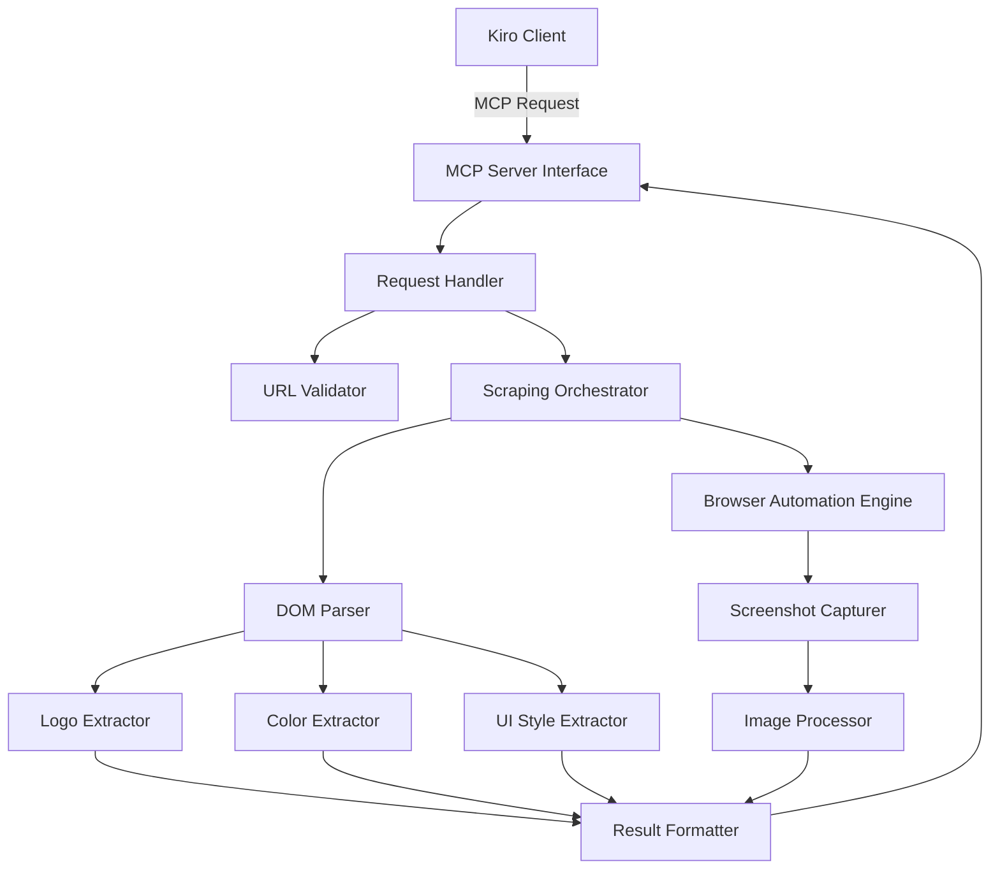
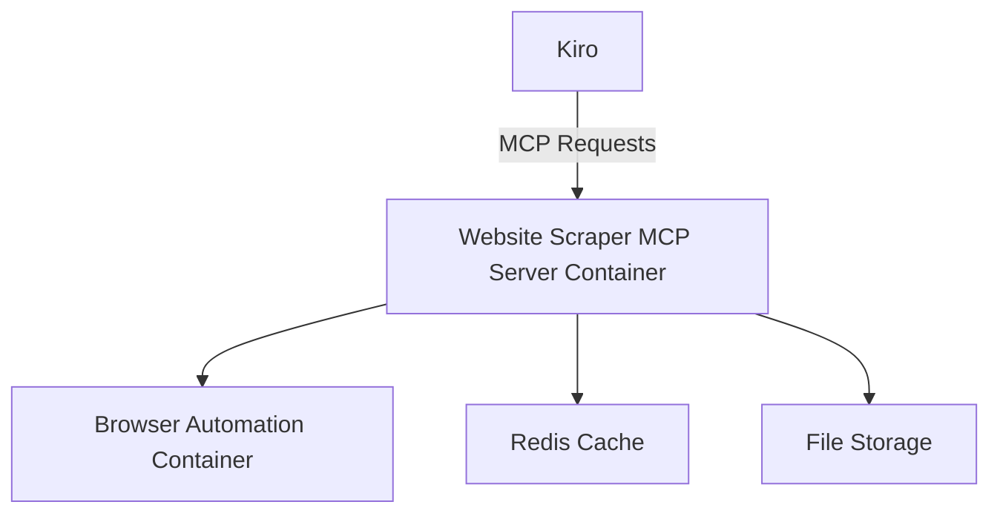

# Design Document: Website Scraper MCP Server

## Overview

The Website Scraper MCP Server is a specialized Model Context Protocol (MCP) server that enables Kiro to extract visual elements from websites, including logos, color palettes, and UI styling information. This server will use web scraping techniques, browser automation, and image processing to analyze websites and provide structured data about their visual design elements.

## Architecture

The Website Scraper MCP Server follows a modular architecture with the following components:



### Key Components

1. **MCP Server Interface**: Implements the Model Context Protocol to communicate with Kiro.
2. **Request Handler**: Processes incoming requests, validates parameters, and routes to appropriate extractors.
3. **URL Validator**: Ensures URLs are valid, accessible, and comply with robots.txt policies.
4. **Scraping Orchestrator**: Coordinates the scraping process across different components.
5. **Browser Automation Engine**: Headless browser instance for rendering JavaScript and capturing visual state.
6. **DOM Parser**: Analyzes the Document Object Model to extract structured information.
7. **Screenshot Capturer**: Takes full or partial screenshots of the rendered page.
8. **Logo Extractor**: Specialized component for identifying and extracting logo images.
9. **Color Extractor**: Analyzes colors used throughout the website.
10. **UI Style Extractor**: Extracts typography, spacing, and component styles.
11. **Image Processor**: Processes extracted images for color analysis and optimization.
12. **Result Formatter**: Structures the extracted data into a consistent response format.

## Components and Interfaces

### MCP Server Interface

```python
class WebScraperMCPServer:
    def register_tools(self):
        """Register the MCP tools with Kiro."""
        return [
            {
                "name": "scrape_website",
                "description": "Scrape a website to extract visual elements",
                "parameters": {
                    "url": "Website URL to scrape",
                    "elements": "List of elements to extract (logos, colors, styles)",
                    "selectors": "Optional CSS selectors to target specific elements"
                }
            },
            {
                "name": "extract_logo",
                "description": "Extract only the logo from a website",
                "parameters": {
                    "url": "Website URL to scrape",
                    "selector": "Optional CSS selector for the logo"
                }
            },
            {
                "name": "extract_colors",
                "description": "Extract color palette from a website",
                "parameters": {
                    "url": "Website URL to scrape",
                    "element_focus": "Optional element type to focus on (buttons, backgrounds, text)"
                }
            },
            {
                "name": "extract_ui_styles",
                "description": "Extract UI styling information from a website",
                "parameters": {
                    "url": "Website URL to scrape",
                    "component_types": "Optional list of component types to focus on"
                }
            }
        ]
    
    async def handle_request(self, tool_name, parameters):
        """Handle incoming MCP requests."""
        # Implementation details
```

### Scraping Orchestrator

```python
class ScrapingOrchestrator:
    def __init__(self, browser_engine, dom_parser, image_processor):
        self.browser_engine = browser_engine
        self.dom_parser = dom_parser
        self.image_processor = image_processor
        
    async def scrape(self, url, elements_to_extract, options=None):
        """Orchestrate the scraping process for the given URL."""
        # Implementation details
        
    async def validate_url(self, url):
        """Validate URL and check robots.txt compliance."""
        # Implementation details
```

### Extractors

```python
class LogoExtractor:
    async def extract(self, page, dom, options=None):
        """Extract logos from the page."""
        # Implementation details
        
class ColorExtractor:
    async def extract(self, page, dom, screenshot, options=None):
        """Extract color palette from the page."""
        # Implementation details
        
class UIStyleExtractor:
    async def extract(self, page, dom, options=None):
        """Extract UI styling information from the page."""
        # Implementation details
```

## Data Models

### Scraping Request

```python
class ScrapingRequest(BaseModel):
    url: str
    elements: List[str] = ["logos", "colors", "styles"]
    selectors: Optional[Dict[str, str]] = None
    options: Optional[Dict[str, Any]] = None
```

### Scraping Result

```python
class Logo(BaseModel):
    url: str
    src: str
    alt: Optional[str] = None
    width: Optional[int] = None
    height: Optional[int] = None
    format: str
    data: Optional[str] = None  # Base64 encoded image data
    
class Color(BaseModel):
    hex: str
    rgb: Tuple[int, int, int]
    hsl: Tuple[int, int, int]
    category: Optional[str] = None  # primary, secondary, accent, etc.
    element_type: Optional[str] = None  # button, text, background, etc.
    frequency: float  # Percentage of usage
    
class Typography(BaseModel):
    font_family: str
    sizes: List[int]
    weights: List[int]
    line_heights: List[float]
    element_types: List[str]  # heading, paragraph, button, etc.
    
class ComponentStyle(BaseModel):
    type: str  # button, form, card, etc.
    css_properties: Dict[str, str]
    
class UIStyle(BaseModel):
    typography: List[Typography]
    spacing: Dict[str, List[int]]
    components: List[ComponentStyle]
    frameworks: List[str]
    breakpoints: Dict[str, int]
    
class ScrapingResult(BaseModel):
    url: str
    timestamp: datetime
    logos: Optional[List[Logo]] = None
    colors: Optional[List[Color]] = None
    color_palette: Optional[Dict[str, List[Color]]] = None
    ui_style: Optional[UIStyle] = None
    screenshots: Optional[Dict[str, str]] = None  # Base64 encoded screenshots
    error: Optional[str] = None
```

## Error Handling

The system will implement comprehensive error handling for various scenarios:

1. **URL Validation Errors**:
   - Invalid URL format
   - Unreachable website
   - Robots.txt restrictions

2. **Scraping Errors**:
   - Timeout errors
   - JavaScript execution errors
   - Content blocking or anti-scraping measures

3. **Extraction Errors**:
   - No logo found
   - Unable to determine color palette
   - Incomplete style information

Each error will be categorized and returned with appropriate HTTP status codes and descriptive messages to help users understand and address the issues.

## Testing Strategy

The testing strategy for the Website Scraper MCP Server includes:

1. **Unit Tests**:
   - Test individual extractors with mock DOM and page objects
   - Validate URL validation logic
   - Test result formatting

2. **Integration Tests**:
   - Test the interaction between components
   - Verify browser automation works correctly
   - Test the MCP interface with mock requests

3. **End-to-End Tests**:
   - Test against a variety of real websites
   - Verify extraction accuracy for different website types
   - Test error handling with problematic websites

4. **Performance Tests**:
   - Measure response times for different website complexities
   - Test concurrent request handling
   - Evaluate memory usage during extraction

## Implementation Considerations

### Technology Stack

- **Programming Language**: Python 3.9+
- **Browser Automation**: Playwright or Puppeteer
- **DOM Parsing**: Beautiful Soup or Parsel
- **Image Processing**: Pillow and ColorThief
- **MCP Implementation**: FastAPI
- **Containerization**: Docker

### Ethical Scraping Practices

The implementation will adhere to ethical scraping practices:

1. Respect robots.txt directives
2. Implement rate limiting to avoid overloading target servers
3. Cache results to minimize redundant requests
4. Provide user-agent identification
5. Only extract publicly available information

### Performance Optimization

To ensure optimal performance:

1. Implement intelligent caching of scraping results
2. Use browser instance pooling for concurrent requests
3. Optimize image processing for large websites
4. Implement timeouts and resource limits
5. Use asynchronous processing where appropriate

### Security Considerations

The implementation will address security concerns:

1. Sanitize and validate all input URLs
2. Implement request rate limiting
3. Avoid executing arbitrary JavaScript from scraped sites
4. Secure storage of temporary files
5. Implement proper error handling to prevent information leakage

## Deployment Architecture

The MCP server will be deployed as a containerized service:



This architecture allows for:
- Isolated execution of browser automation
- Scalable deployment
- Efficient resource utilization
- Proper separation of concerns