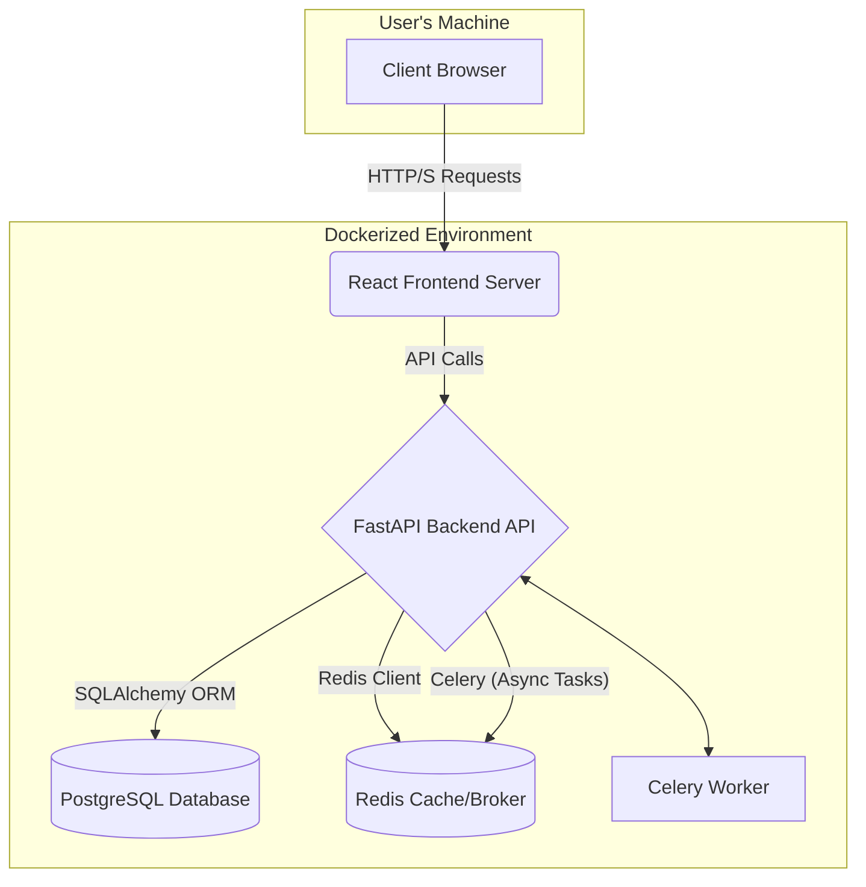
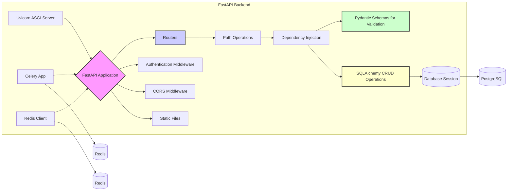
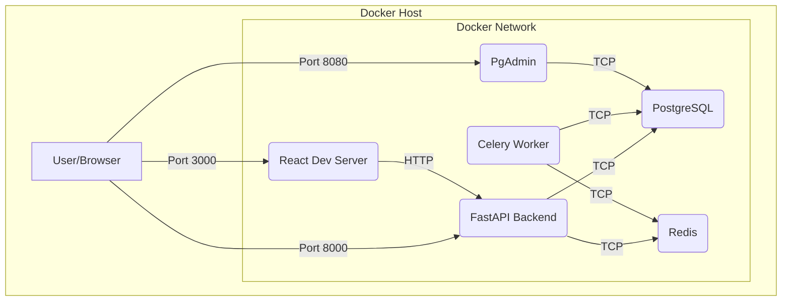

# ABParts App Analysis

This document provides an extensive analysis of the ABParts application from the perspectives of a Software Architect, Software Developer, and Product Manager.

## Table of Contents

1.  [Software Architect Perspective](#1-software-architect-perspective)
    *   [Overall System Architecture](#overall-system-architecture)
    *   [Backend Architecture](#backend-architecture)
    *   [Frontend Architecture](#frontend-architecture)
    *   [Data Management](#data-management)
    *   [Deployment and Infrastructure](#deployment-and-infrastructure)
    *   [Key Architectural Patterns](#key-architectural-patterns)
    *   [Technology Choices Rationale](#technology-choices-rationale)
    *   [Potential Improvements](#potential-improvements-architect)
2.  [Software Developer Perspective](#2-software-developer-perspective)
    *   [Code Structure and Organization](#code-structure-and-organization)
    *   [Backend Development Details](#backend-development-details)
    *   [Frontend Development Details](#frontend-development-details)
    *   [API Design](#api-design)
    *   [Error Handling and Logging](#error-handling-and-logging)
    *   [Testing](#testing)
    *   [Development Environment](#development-environment)
    *   [Potential Improvements](#potential-improvements-developer)
3.  [Product Manager Perspective](#3-product-manager-perspective)
    *   [Application Purpose and Value Proposition](#application-purpose-and-value-proposition)
    *   [Target Users and Roles](#target-users-and-roles)
    *   [Key Features and Functionality](#key-features-and-functionality)
    *   [User Workflows](#user-workflows)
    *   [Data Insights and Reporting (Potential)](#data-insights-and-reporting-potential)
    *   [Potential Future Enhancements](#potential-future-enhancements)

---

## 1. Software Architect Perspective

### Overall System Architecture

The ABParts system is a modern web application designed with a client-server architecture. It consists of a React frontend, a FastAPI backend, a PostgreSQL database, and a Redis instance for caching and asynchronous task management (though Celery tasks are defined, their specific use isn't fully detailed in the provided `main.py`). Docker and Docker Compose are used for containerization and orchestration, simplifying development, deployment, and scaling.



**Components:**

*   **Frontend (React):** A single-page application (SPA) providing the user interface. It communicates with the backend via RESTful API calls.
*   **Backend (FastAPI):** A Python-based API server that handles business logic, data processing, and communication with the database and other services.
*   **Database (PostgreSQL):** A relational database used to store persistent data such as organizations, users, parts, orders, etc.
*   **Cache/Broker (Redis):** Used for caching frequently accessed data to improve performance and potentially as a message broker for Celery tasks.
*   **Celery Worker (Python):** For handling background tasks asynchronously, such as ML engine predictions or report generation (current implementation details are minimal in `main.py` but `celery_app.py` and `tasks.py` exist).
*   **Docker & Docker Compose:** Containerizes each service for consistent environments and easy deployment.

### Backend Architecture

The backend is built using FastAPI, a modern, high-performance Python web framework.



**Key Layers and Components:**

*   **ASGI Server (Uvicorn):** Handles incoming HTTP requests and passes them to the FastAPI application.
*   **FastAPI Application (`main.py`):** The entry point of the backend. It initializes middleware (CORS, StaticFiles), includes routers, and defines global configurations.
*   **Routers (`backend/app/routers/`):** Organize API endpoints by resource (e.g., `users.py`, `parts.py`). This promotes modularity.
*   **Path Operations (Endpoints):** Functions within routers that handle specific HTTP methods (GET, POST, PUT, DELETE) for different URL paths. They define request handling logic.
*   **Dependency Injection (`Depends`):** FastAPI's powerful system for managing dependencies, such as database sessions (`get_db`) or authenticated user data.
*   **Pydantic Schemas (`schemas.py`):** Used for data validation (incoming request bodies) and serialization (outgoing responses). Ensures data integrity and provides clear data contracts.
*   **SQLAlchemy Models (`models.py`):** Define the database table structures as Python classes. ORM (Object-Relational Mapper) for interacting with the PostgreSQL database.
*   **CRUD Operations (`crud/`):** Functions that encapsulate common database operations (Create, Read, Update, Delete) for each model. This separates database logic from endpoint logic.
*   **Database Module (`database.py`):** Configures the database connection (SQLAlchemy engine, sessionmaker) and Redis client.
*   **Authentication (`auth.py`):** Handles user authentication (JWT-based) and authorization.
*   **Static Files:** Serves static assets like images directly from the backend (e.g., for part images).
*   **Celery (`celery_app.py`, `tasks.py`):** Setup for asynchronous task processing, using Redis as a broker.

### Frontend Architecture

The frontend is a React single-page application (SPA) built using Create React App (implied by structure and scripts).

```mermaid
graph TD
    subgraph "React Frontend"
        A[index.js] --> B(App.js);
        B --> C{AuthContext};
        B --> D[Router];
        D --> E[Page Components/Views];
        E --> F[Reusable UI Components];
        F --> G[API Service Calls];
        G --> H{Backend API};
        C --> E;
        C --> G;
        I[State Management (useState, useEffect)] --> E;
        I --> F;
        J[Tailwind CSS] --> E;
        J --> F;
    end

    style B fill:#f9f,stroke:#333,stroke-width:2px
    style C fill:#ccf,stroke:#333,stroke-width:2px
    style J fill:#cfc,stroke:#333,stroke-width:2px
```

**Key Components:**

*   **`index.js`:** The entry point of the React application, renders the main `App` component.
*   **`App.js`:** The root component, responsible for overall layout, routing (though routing isn't explicitly shown, it's typical for SPAs), and orchestrating data fetching and display for various sections.
*   **`AuthContext.js`:** Manages authentication state (token, user details) and provides login/logout functionality throughout the application using React Context API.
*   **Components (`components/`):**
    *   **Form Components (e.g., `LoginForm.js`, `PartForm.js`):** Reusable components for handling data input and submission for different entities.
    *   **Modal Component (`Modal.js`):** A generic modal component for displaying forms or other content in a dialog.
    *   (Implicitly) **View/Page Components:** `App.js` itself acts as a main view, dynamically rendering sections based on fetched data. For a larger application, these would be separate components managed by a router like React Router.
*   **API Interaction:** Components fetch data from and send data to the backend API using the `fetch` API. The `API_BASE_URL` is configurable.
*   **State Management:** Primarily uses React's built-in hooks (`useState`, `useEffect`, `useContext`). For a larger application, a dedicated state management library (Redux, Zustand) might be considered.
*   **Styling (Tailwind CSS):** Utility-first CSS framework used for styling the application. Configuration is in `tailwind.config.js` and `postcss.config.js`.
*   **Build Process:** Uses `npm` scripts (implied by `package.json`) for development server and production builds.

### Data Management

#### Database Schema (PostgreSQL)

The database schema is defined in `backend/app/models.py` using SQLAlchemy and initialized via `init_db/init.sql`.

**Key Entities:**

*   **`organizations`**: Represents Oraseas EE, customer companies, and suppliers.
*   **`users`**: Users associated with organizations, with roles for authorization.
*   **`machines`**: Represents AutoBoss machines owned by customer organizations.
*   **`parts`**: Details about spare parts (part number, name, description, proprietary/consumable flags, image URLs).
*   **`inventory`**: Tracks stock levels of parts for each organization, including minimum stock recommendations.
*   **`supplier_orders`**: Orders placed by Oraseas EE to external suppliers.
*   **`supplier_order_items`**: Line items for supplier orders.
*   **`customer_orders`**: Orders placed by customers to Oraseas EE.
*   **`customer_order_items`**: Line items for customer orders.
*   **`part_usage`**: Records consumption of parts by customers, potentially linked to specific machines.

**Relationships (Illustrative Mermaid Diagram):**

```mermaid
erDiagram
    ORGANIZATIONS ||--o{ USERS : "has"
    ORGANIZATIONS ||--o{ MACHINES : "owns"
    ORGANIZATIONS ||--o{ INVENTORY : "holds"
    ORGANIZATIONS ||--o{ SUPPLIER_ORDERS : "places (as Oraseas)"
    ORGANIZATIONS ||--o{ CUSTOMER_ORDERS : "places (as Customer)"
    ORGANIZATIONS ||--o{ CUSTOMER_ORDERS : "receives (as Oraseas)"
    ORGANIZATIONS ||--o{ PART_USAGE : "records for"

    USERS ||--o{ CUSTOMER_ORDERS : "ordered by"
    USERS ||--o{ PART_USAGE : "recorded by"

    MACHINES ||--o{ PART_USAGE : "consumes on"

    PARTS ||--o{ INVENTORY : "is tracked in"
    PARTS ||--o{ SUPPLIER_ORDER_ITEMS : "is part of"
    PARTS ||--o{ CUSTOMER_ORDER_ITEMS : "is part of"
    PARTS ||--o{ PART_USAGE : "is used in"

    SUPPLIER_ORDERS ||--o{ SUPPLIER_ORDER_ITEMS : "contains"
    CUSTOMER_ORDERS ||--o{ CUSTOMER_ORDER_ITEMS : "contains"

    SUPPLIER_ORDERS {
        UUID id PK
        UUID ordering_organization_id FK
        string supplier_name
        datetime order_date
        datetime expected_delivery_date
        string status
    }
    CUSTOMER_ORDERS {
        UUID id PK
        UUID customer_organization_id FK
        UUID oraseas_organization_id FK
        datetime order_date
        string status
        UUID ordered_by_user_id FK
    }
    PARTS {
        UUID id PK
        string part_number UK
        string name
        boolean is_proprietary
        boolean is_consumable
        string[] image_urls
    }
    INVENTORY {
        UUID id PK
        UUID organization_id FK
        UUID part_id FK
        integer current_stock
        integer minimum_stock_recommendation
        Unique(organization_id, part_id)
    }
    PART_USAGE {
        UUID id PK
        UUID customer_organization_id FK
        UUID part_id FK
        datetime usage_date
        integer quantity_used
        UUID machine_id FK
    }
```

*   **Primary Keys:** UUIDs are used for all primary keys, promoting uniqueness across distributed systems if needed.
*   **Foreign Keys:** Enforce relational integrity between tables.
*   **Timestamps:** `created_at` and `updated_at` fields are standard for tracking record changes.
*   **Unique Constraints:** Applied to fields like `organization.name`, `user.username`, `part.part_number`, and composite keys like `inventory(organization_id, part_id)`.

#### Data Flow

1.  **User Interaction (Frontend):** User interacts with the React UI (e.g., fills a form to create a part).
2.  **API Request (Frontend to Backend):** Frontend makes an API call (e.g., POST to `/parts`) with payload.
3.  **Request Handling (Backend):**
    *   FastAPI router receives the request.
    *   Pydantic schema validates the incoming data.
    *   Path operation function is executed.
    *   Dependencies (like DB session, current user) are injected.
4.  **CRUD Operation (Backend):**
    *   CRUD function is called (e.g., `crud.part.create_part()`).
    *   SQLAlchemy model instance is created.
    *   Session commits the transaction to the PostgreSQL database.
5.  **Response (Backend to Frontend):**
    *   Backend sends a JSON response (e.g., the created part data, validated by a Pydantic response schema).
6.  **UI Update (Frontend):** Frontend receives the response and updates the UI (e.g., adds the new part to a list).

**Data Caching (Redis):**
While `redis_client` is initialized in `database.py` and a health check for Redis exists, explicit caching logic (e.g., cache-aside pattern for GET requests) is not evident in the provided `main.py` or router files. It's likely intended for future use or for Celery.

### Deployment and Infrastructure

The application is designed to be deployed using Docker and Docker Compose.

**`docker-compose.yml` Overview:**

*   **`db` service:** PostgreSQL database.
    *   Uses official `postgres:15` image.
    *   Persistent data via `db_data` volume.
    *   Initial SQL scripts from `init_db/` are run on startup.
    *   Healthcheck ensures DB is ready before dependent services start.
*   **`redis` service:** Redis server.
    *   Uses official `redis:latest` image.
    *   AOF persistence enabled.
    *   Healthcheck ensures Redis is ready.
*   **`api` service:** FastAPI backend.
    *   Builds from `backend/Dockerfile.backend`.
    *   Environment variables for `DATABASE_URL` and `REDIS_URL` are configured to connect to other services.
    *   Code volume mounted for live reloading in development (`./backend:/app`).
    *   `api_static_images` volume for storing uploaded images.
    *   Depends on `db` and `redis` being healthy.
    *   Runs `uvicorn` with `--reload`.
*   **`celery_worker` service:** Celery worker for background tasks.
    *   Uses the same Docker image as the `api` service.
    *   Connects to Redis (broker) and PostgreSQL.
    *   Depends on `db` and `redis`.
    *   Runs `celery -A app.celery_app worker`.
*   **`pgadmin` service:** PgAdmin4 for database management.
    *   Uses `dpage/pgadmin4` image.
    *   Persistent data via `pgadmin_data` volume.
*   **`web` service:** React frontend development server.
    *   Builds from `frontend/Dockerfile.frontend`.
    *   Code volume mounted for live reloading (`./frontend:/app`).
    *   `REACT_APP_API_BASE_URL` environment variable to point to the backend.
    *   Runs `npm install && npm start`.

**Infrastructure Diagram (from Docker Compose):**



This setup is well-suited for local development and can be adapted for production with appropriate modifications (e.g., using a production-grade ASGI server like Gunicorn with Uvicorn workers, managed database/Redis services, ingress controllers, etc.).

### Key Architectural Patterns

*   **Client-Server Architecture:** Standard for web applications.
*   **RESTful API Design:** Backend exposes resources via HTTP methods and URLs.
*   **Model-View-Controller (MVC) like pattern (Backend):**
    *   **Models:** SQLAlchemy models (`models.py`).
    *   **Views (Path Operations/Endpoints):** Logic in router files that handles requests and prepares responses.
    *   **Controllers (CRUD functions/Service Layer):** Business logic encapsulated in `crud/` functions.
*   **Single Page Application (SPA) (Frontend):** React manages views and user interactions on the client-side, reducing full page loads.
*   **Component-Based Architecture (Frontend):** React encourages building UIs from reusable components.
*   **Dependency Injection (Backend):** FastAPI's `Depends` system simplifies managing and providing dependencies.
*   **ORM (Object-Relational Mapper):** SQLAlchemy abstracts database interactions.
*   **Containerization (Docker):** Ensures consistency across environments.
*   **Microservices-like (Potential):** While currently a monolith, the separation of frontend, backend, and workers allows for potential future evolution towards microservices if needed. The `celery_worker` is a distinct service.
*   **Repository Pattern (Backend):** The `crud/` modules act as repositories, abstracting data access logic.
*   **Data Validation/Serialization (Backend):** Pydantic schemas handle this robustly.

### Technology Choices Rationale

*   **Python (Backend):** Large ecosystem, suitable for web development, data science (ML engine potential).
*   **FastAPI (Backend):** High performance (async support via Starlette and Uvicorn), automatic data validation and serialization with Pydantic, OpenAPI/Swagger UI generation, dependency injection. A modern choice for building APIs.
*   **SQLAlchemy (Backend):** Mature and powerful ORM for Python, database-agnostic (though used with PostgreSQL here).
*   **PostgreSQL (Database):** Robust, open-source relational database with advanced features (JSONB, extensions like UUID-OSSP).
*   **Redis (Cache/Broker):** Fast in-memory data store, suitable for caching, session management, and as a message broker for Celery.
*   **React (Frontend):** Popular, component-based JavaScript library for building dynamic UIs. Large community and ecosystem.
*   **Tailwind CSS (Frontend):** Utility-first CSS framework that allows for rapid UI development without writing custom CSS.
*   **Docker & Docker Compose:** Standard for containerization and local development orchestration, simplifies dependency management and deployment.
*   **Celery (Backend):** Distributed task queue for handling asynchronous operations, improving responsiveness and scalability.

These choices reflect a modern, performance-oriented, and developer-friendly stack.

### Potential Improvements (Architectural)

*   **Explicit Caching Strategy:** Implement caching for frequently read, rarely changing data (e.g., part details, organization lists) using Redis to reduce database load and improve API response times.
*   **API Gateway:** For a production deployment, especially if evolving towards microservices, an API Gateway (e.g., Nginx, Traefik, cloud-specific options) could handle SSL termination, rate limiting, request routing, and authentication.
*   **Service Discovery:** If more services are added, a service discovery mechanism (e.g., Consul, etcd, or Docker's built-in DNS) would be beneficial.
*   **Centralized Logging & Monitoring:** Implement a centralized logging solution (e.g., ELK stack, Grafana Loki) and monitoring (e.g., Prometheus, Grafana) for better observability in production.
*   **Scalability Considerations:**
    *   Stateless API: Ensure the API remains stateless for easier horizontal scaling.
    *   Database Read Replicas: For read-heavy workloads.
    *   Celery Worker Scaling: Adjust the number of Celery workers based on task load.
*   **Security Enhancements:**
    *   More granular role-based access control (RBAC) if needed beyond the current roles.
    *   Input sanitization in addition to Pydantic validation for defense in depth.
    *   Regular security audits and dependency updates.
*   **Data Archival/Backup Strategy:** Define and implement strategies for database backups and potentially archiving old data (e.g., old orders, usage logs).
*   **Event-Driven Architecture (Potential):** For certain workflows (e.g., order status updates, inventory changes), an event-driven approach could decouple services and improve resilience. This could involve using Kafka or RabbitMQ instead of/alongside Redis for more robust messaging.

---

## 2. Software Developer Perspective

### Code Structure and Organization

**Backend (`backend/app/`):**

*   **`main.py`:** FastAPI app initialization, middleware, global routes (health, token), startup events.
*   **`auth.py`:** Authentication logic (JWT, password hashing, user fetching).
*   **`celery_app.py`:** Celery application instance setup.
*   **`tasks.py`:** Celery task definitions (currently placeholder).
*   **`database.py`:** Database engine, session management, Redis client initialization.
*   **`models.py`:** SQLAlchemy ORM models (database table definitions).
*   **`schemas.py`:** Pydantic schemas for request/response validation and serialization.
*   **`crud/`:** Directory containing modules for database interaction logic (Create, Read, Update, Delete) for each model. This separates business logic from API routing.
    *   Example: `crud/parts.py`, `crud/users.py`.
*   **`routers/`:** Directory containing API route definitions, organized by resource.
    *   Example: `routers/parts.py`, `routers/users.py`.
*   `static/images/`: Directory for storing uploaded images (though this should ideally be managed by a dedicated file storage service in production).

**Frontend (`frontend/src/`):**

*   **`index.js`:** Main entry point, renders `App`.
*   **`App.js`:** Root component, handles main layout, data fetching for dashboard views, and modal states.
*   **`AuthContext.js`:** Context for managing authentication state.
*   **`components/`:** Contains reusable React components.
    *   `LoginForm.js`
    *   `Modal.js`
    *   Various `*Form.js` components for creating/editing entities (e.g., `OrganizationForm.js`, `PartForm.js`).
*   **`index.css`:** Main CSS file (likely imports Tailwind base styles).
*   `tailwind.config.js`, `postcss.config.js`: Configuration for Tailwind CSS.

**Overall:** The project structure is quite logical and follows common conventions for FastAPI and React applications. The separation of concerns (routers, CRUD, schemas, models in backend; components, context in frontend) is good.

### Backend Development Details

*   **Framework:** FastAPI.
*   **Language:** Python 3 (version depends on Docker image, likely 3.8+).
*   **ORM:** SQLAlchemy.
*   **Data Validation/Serialization:** Pydantic.
*   **Asynchronous Support:** FastAPI is async-native. Path operations can be `async def`. Database calls via SQLAlchemy are generally synchronous in this setup but can be made async with `asyncpg` and SQLAlchemy's async support.
*   **Dependency Management:** `requirements.txt` for Python packages.
*   **Key Libraries:**
    *   `fastapi`: Core framework.
    *   `uvicorn`: ASGI server.
    *   `sqlalchemy`: ORM.
    *   `psycopg2-binary`: PostgreSQL adapter.
    *   `pydantic`: Data validation.
    *   `python-jose[cryptography]`: JWT handling.
    *   `passlib[bcrypt]`: Password hashing.
    *   `redis`: Redis client.
    *   `celery`: Asynchronous task queue.
    *   `python-multipart`: For file uploads.

**Code Snippet (Example CRUD operation - `crud/parts.py` - illustrative, not provided in initial files):**

```python
# Example structure (conceptual)
# from sqlalchemy.orm import Session
# from .. import models, schemas

# def get_part(db: Session, part_id: uuid.UUID):
#     return db.query(models.Part).filter(models.Part.id == part_id).first()

# def create_part(db: Session, part: schemas.PartCreate):
#     db_part = models.Part(**part.model_dump())
#     db.add(db_part)
#     db.commit()
#     db.refresh(db_part)
#     return db_part
```

### Frontend Development Details

*   **Framework/Library:** React.
*   **Language:** JavaScript (ES6+).
*   **State Management:** React Context API (`AuthContext`) and component local state (`useState`, `useEffect`).
*   **Styling:** Tailwind CSS.
*   **API Communication:** `fetch` API.
*   **Package Management:** `npm` (evident from `package.json`, `package-lock.json`).
*   **Build Tooling:** Create React App (implied by structure and `react-scripts`).
*   **Key Libraries:**
    *   `react`, `react-dom`.
    *   (Likely) `react-router-dom` for routing if more pages were added.
    *   Tailwind CSS and its dependencies (`postcss`, `autoprefixer`).

**Code Snippet (Example data fetching in `App.js`):**

```javascript
// useEffect(() => {
//     const fetchData = async () => {
//         if (!token) { /* ... */ return; }
//         setLoadingData(true);
//         try {
//             const orgsResponse = await fetch(`${API_BASE_URL}/organizations`, {
//                 headers: { 'Authorization': `Bearer ${token}` },
//             });
//             if (!orgsResponse.ok) throw new Error('Failed to fetch organizations');
//             const orgsData = await orgsResponse.json();
//             setOrganizations(orgsData);
//             // ... fetch other data ...
//         } catch (err) {
//             setError(err.message);
//         } finally {
//             setLoadingData(false);
//         }
//     };
//     if (!loadingUser) fetchData();
// }, [token, API_BASE_URL, loadingUser, fetchData]); // fetchData added to dependencies
```
The `fetchData` function is wrapped in `useCallback` to prevent re-creation on every render, which is good practice when it's a dependency of `useEffect`.

### API Design

*   **RESTful Principles:** The API generally follows REST principles (e.g., `/parts`, `/users` as resource paths).
*   **HTTP Methods:** Uses GET, POST, PUT, DELETE appropriately (implied by CRUD operations).
*   **Authentication:** JWT-based Bearer token authentication for protected endpoints. `/token` endpoint for obtaining tokens.
*   **Data Format:** JSON for request and response bodies.
*   **Versioning:** Indicated as `version="0.1.0"` in FastAPI app, but no explicit URL versioning (e.g., `/api/v1/parts`).
*   **Routers:** API endpoints are logically grouped into routers (e.g., `organizations_router`, `parts_router`), which is good for maintainability.
*   **Error Responses:** FastAPI provides default JSON error responses. Custom error handling can be implemented with exception handlers.
*   **OpenAPI Documentation:** FastAPI automatically generates OpenAPI (Swagger UI at `/docs` and ReDoc at `/redoc`) documentation based on Pydantic schemas and path operations, which is a huge plus for developers.

### Error Handling and Logging

*   **Backend:**
    *   FastAPI handles Pydantic validation errors automatically, returning 422 responses.
    *   HTTPExceptions are used for other common HTTP errors (e.g., 401 Unauthorized, 404 Not Found).
    *   Basic logging is configured in `main.py` (`logging.basicConfig(level=logging.INFO)`). Specific logging within endpoints or services could be more detailed.
    *   The health check endpoint provides some basic diagnostic information for DB and Redis connectivity.
*   **Frontend:**
    *   `try...catch` blocks are used around `fetch` calls in `App.js` to catch network or HTTP errors.
    *   Error messages are stored in component state and displayed to the user.
    *   `console.error` is used for logging errors in the browser console.

### Testing

*   No explicit test files (e.g., `test_*.py` or `*.test.js`) are visible in the provided file list.
*   **Backend:** FastAPI applications are highly testable using `pytest` and `TestClient`. Tests should cover:
    *   Unit tests for CRUD operations and business logic.
    *   Integration tests for API endpoints.
*   **Frontend:** React components can be tested using libraries like Jest and React Testing Library. Tests should cover:
    *   Unit tests for individual components.
    *   Integration tests for component interactions and user flows.
    *   End-to-end tests (e.g., using Cypress or Playwright) could test the whole application flow.

The absence of tests is a significant gap for a production-ready application.

### Development Environment

*   **Containerized:** `docker-compose.yml` defines the entire development stack (PostgreSQL, Redis, backend API, frontend dev server, Celery worker, PgAdmin).
*   **Live Reloading:**
    *   Backend: `uvicorn --reload` watches for Python file changes.
    *   Frontend: React development server (`npm start`) provides hot module replacement (HMR).
*   **Database Initialization:** `init_db/init.sql` creates the schema and seeds initial data, which is very helpful for development.
*   **Environment Variables:** Used for configuration (e.g., `DATABASE_URL`, `REDIS_URL`, `REACT_APP_API_BASE_URL`). A `.env` file (added to `.gitignore`) is typically used with Docker Compose to manage these.

This setup provides a consistent and easy-to-spin-up development environment.

### Potential Improvements (Developer Experience & Code Quality)

*   **Implement Comprehensive Testing:** Add unit, integration, and potentially E2E tests for both backend and frontend.
*   **Linters and Formatters:** Integrate tools like Black, Flake8, isort for Python, and ESLint, Prettier for JavaScript/React to enforce code style and catch errors early.
*   **Type Hinting (Python):** Already well-used with Pydantic and FastAPI, continue ensuring comprehensive type hints for better static analysis and code clarity.
*   **Frontend State Management:** For more complex state interactions, consider a dedicated state management library (e.g., Zustand, Redux Toolkit).
*   **API Client Generation (Frontend):** For larger APIs, consider generating an API client library from the OpenAPI spec (e.g., using `openapi-typescript-codegen`) to provide typed API calls.
*   **Backend Service Layer:** For more complex business logic beyond simple CRUD, introduce a service layer between routers and CRUD operations to encapsulate this logic and make it more testable.
*   **Configuration Management:** Use a more robust configuration management approach for the backend if complexity grows (e.g., Pydantic's `BaseSettings`).
*   **Detailed Logging:** Add more specific and structured logging in the backend, especially for critical operations and error conditions.
*   **CI/CD Pipeline:** Set up a Continuous Integration/Continuous Deployment pipeline (e.g., GitHub Actions, GitLab CI) to automate testing, linting, building, and deployment.
*   **Frontend Routing:** If the application grows, implement client-side routing using `react-router-dom` for better navigation and page structure. `App.js` currently handles display of all sections on one page.
*   **Code Comments and Documentation:** While FastAPI provides auto-docs, ensure complex logic within functions is well-commented. Maintain docstrings.
*   **Optimize Frontend Data Fetching:**
    *   Currently, `App.js` fetches all data for all sections. This could be optimized by fetching data only for the currently relevant/visible sections or when a user navigates to a specific part of the dashboard.
    *   Consider libraries like React Query (TanStack Query) or SWR for data fetching, caching, and synchronization in React, which can simplify loading/error states and improve UX.
*   **Image Handling (Backend):** Storing uploaded images in a volume (`api_static_images`) is fine for development, but for production, a dedicated object storage service (like AWS S3, Google Cloud Storage) is recommended for scalability, durability, and serving efficiency. URLs in `Part.image_urls` would then point to the CDN/storage service.

---

## 3. Product Manager Perspective

### Application Purpose and Value Proposition

**ABParts** is an inventory and order management system designed to streamline operations for "Oraseas EE" (presumably the primary user/administrator of the system) and its customers (e.g., "Autoboss Inc").

**Value Proposition:**

*   **For Oraseas EE:**
    *   Centralized tracking of parts inventory across its own warehouse and potentially customer locations.
    *   Management of supplier orders for replenishing stock.
    *   Processing and tracking of customer orders for parts.
    *   Visibility into part usage by customers.
    *   Potential for data-driven stock recommendations (e.g., `minimum_stock_recommendation`).
    *   Improved efficiency in managing parts lifecycle from procurement to customer consumption.
*   **For Oraseas EE's Customers (e.g., Autoboss Inc):**
    *   Simplified ordering of parts from Oraseas EE.
    *   Tracking of their own parts inventory if Oraseas EE manages it for them (consignment stock model).
    *   Recording part usage, potentially for maintenance logging or reordering triggers.
    *   Visibility into their order history and status.

The system aims to reduce manual effort, improve accuracy in inventory management, optimize stock levels, and enhance service delivery to customers.

### Target Users and Roles

Based on `models.User.role` and frontend conditional rendering:

1.  **Oraseas Admin:**
    *   Super user with full access.
    *   Manages organizations (Oraseas, customers, suppliers).
    *   Manages users across all organizations.
    *   Manages parts catalog.
    *   Manages inventory for Oraseas and potentially customers.
    *   Manages supplier orders and customer orders.
    *   Views part usage records.
2.  **Oraseas Inventory Manager:** (Implied by frontend button visibility for adding inventory/orders)
    *   Focuses on inventory and order management.
    *   Manages inventory for Oraseas.
    *   Manages supplier orders and customer orders.
3.  **Customer Admin:** (e.g., 'Autoboss Admin')
    *   Manages users within their own organization.
    *   Places customer orders.
    *   Records part usage for their organization.
    *   Views their organization's inventory (if applicable).
4.  **Customer User:**
    *   Places customer orders.
    *   Records part usage for their organization.
    *   Views their organization's inventory (if applicable).
5.  **Supplier User:** (Role exists in `init.sql` but functionality not explicitly detailed in `App.js`)
    *   Potentially views orders placed with them or manages their part catalog if they supply parts directly. (This workflow needs clarification).

The role system allows for tailored access and functionality based on user responsibilities.

### Key Features and Functionality

*   **Organization Management:** Create and manage different types of organizations (Warehouse, Customer, Supplier).
*   **User Management:** Create and manage users with specific roles and assign them to organizations.
*   **Authentication & Authorization:** Secure login, token-based authentication, role-based access to features.
*   **Part Catalog Management:**
    *   Define parts with details (part number, name, description, proprietary/consumable status, delivery times).
    *   Upload and display part images.
*   **Inventory Tracking:**
    *   Manage stock levels for each part within specific organizations.
    *   Set minimum stock recommendations and reorder thresholds.
*   **Supplier Order Management:**
    *   Create and track orders placed with external suppliers.
    *   Manage order items, quantities, and prices.
    *   Update order status (Pending, Shipped, Delivered).
*   **Customer Order Management:**
    *   Customers can place orders for parts.
    *   Oraseas EE can process and track these orders.
    *   Manage order items, quantities, and prices.
    *   Update order status.
*   **Part Usage Recording:**
    *   Customers can record when parts are used, quantity, usage date, and optionally link to a specific machine.
*   **Machine Management:** (Newer feature)
    *   Organizations can register their machines (model, name, serial number).
    *   Link part usage to specific machines.
*   **Dashboard Overview (Frontend `App.js`):**
    *   Displays lists of organizations, users, parts, inventory items, supplier orders (and items), customer orders (and items), and part usages.
    *   Provides forms (via modals) to add new entities for authorized users.

### User Workflows

1.  **New Customer Onboarding (Oraseas Admin):**
    *   Login as Oraseas Admin.
    *   Navigate to "Organizations" -> "Add Organization" (create customer org).
    *   Navigate to "Users" -> "Add User" (create Customer Admin for the new org).
2.  **Part Catalog Setup (Oraseas Admin):**
    *   Login as Oraseas Admin.
    *   Navigate to "Parts" -> "Add Part" (define new part details, upload image).
    *   Repeat for all parts.
3.  **Initial Stocking (Oraseas Admin/Inventory Manager):**
    *   Login.
    *   Navigate to "Inventory" -> "Add Inventory Item" (set initial stock for parts at Oraseas warehouse).
    *   Alternatively, create a "Supplier Order" to procure parts from a supplier, then update inventory upon delivery.
4.  **Customer Places an Order (Customer Admin/User):**
    *   Login.
    *   Navigate to "Customer Orders" -> "Add Customer Order".
    *   Fill order details (target Oraseas org, their org, items).
    *   (Oraseas Admin/Inventory Manager then views and processes this order).
5.  **Customer Records Part Usage (Customer Admin/User):**
    *   Login.
    *   Navigate to "Part Usage" -> "Record Part Usage".
    *   Select part, quantity, date, associated machine (if any).
6.  **Supplier Order Placement (Oraseas Admin/Inventory Manager):**
    *   Login.
    *   Navigate to "Supplier Orders" -> "Add Supplier Order".
    *   Select supplier, add parts, quantities.
    *   Track order until delivery, then update Oraseas inventory.

### Data Insights and Reporting (Potential)

The current system primarily focuses on operational data entry and viewing. However, the collected data has significant potential for insights:

*   **Inventory Optimization:**
    *   Identify slow-moving vs. fast-moving parts.
    *   Analyze consumption patterns to refine `minimum_stock_recommendation`.
    *   Forecast demand based on historical usage and customer orders.
*   **Customer Behavior:**
    *   Most frequently ordered parts by customer.
    *   Ordering frequency and patterns.
*   **Supplier Performance:**
    *   Track delivery times against expected times.
    *   Identify reliable vs. unreliable suppliers (if multiple suppliers are used for same parts).
*   **Machine Maintenance:**
    *   Track part consumption per machine to predict maintenance needs or identify machines with high part usage.
*   **Financial Reporting (Basic):**
    *   Value of current inventory.
    *   Cost of goods sold (COGS) based on part usage and supplier prices (if unit prices are consistently tracked).

**To realize these insights, dedicated reporting/analytics features would be needed, potentially integrated with the Celery worker for data processing.**

### Potential Future Enhancements (Product Features)

*   **Dashboard with KPIs:** A summary dashboard with key metrics (e.g., low stock alerts, pending orders, total inventory value).
*   **Notifications & Alerts:**
    *   Low stock alerts for Oraseas EE.
    *   Order status update notifications for customers.
*   **Advanced Reporting & Analytics:**
    *   Export data to CSV/Excel.
    *   Visual charts and graphs for trends (e.g., part usage over time).
*   **Batch Operations:** For easier management of large datasets (e.g., batch updating inventory, importing parts).
*   **User Self-Service Password Reset.**
*   **More Granular Permissions/Roles:** If needed, expand the role system for finer control.
*   **Supplier Portal:** Allow suppliers to log in, view purchase orders from Oraseas EE, and potentially update shipment information or manage their part listings.
*   **Customer Portal Enhancements:**
    *   View detailed order history with tracking.
    *   Request quotes.
    *   View their specific machine details and associated part usage history.
*   **Integration with Accounting Systems.**
*   **Mobile Application/Responsive Design Improvements:** Ensure the frontend is fully responsive or consider a dedicated mobile app for field technicians or users on the go.
*   **Barcode/QR Code Scanning:** For easier inventory management and part identification.
*   **ML-Powered Stock Recommendations:** Enhance the `minimum_stock_recommendation` using the Celery worker to run more sophisticated demand forecasting models based on usage patterns, seasonality, etc.
*   **Return Management (RMAs):** Workflow for handling part returns from customers.
*   **Multi-language Support.**
